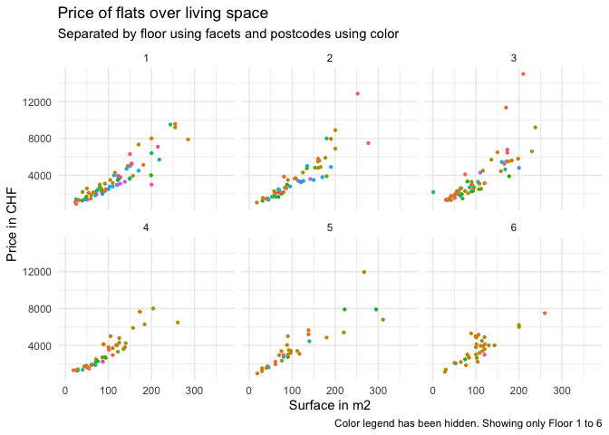
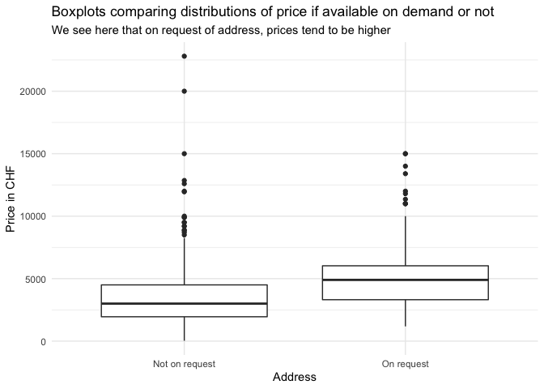
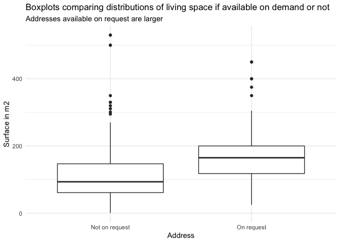
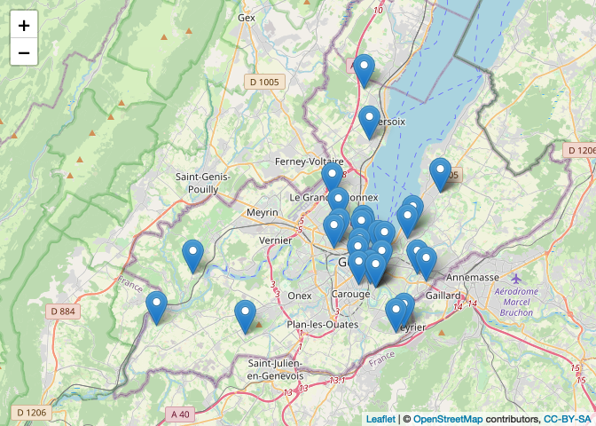

FDS Final Project: Report \#1
================

#### Libraries

``` r
library(rvest)
library(xml2)
library(httr)
library(tidyverse)
library(lubridate)
library(ggthemes)
library(infer)
library(opencage)
library(leaflet)
library(kableExtra)
```

#### Setting the main plot theme

``` r
theme_set(theme_minimal())
```

## Part 1

##### Getting the 9 different headers of the table we want from html page :

<https://epfl-exts.github.io/rental-scrape/>

``` r
rental_data <- read_html("https://epfl-exts.github.io/rental-scrape/") 

location <- rental_data %>% 
  html_nodes(".address") %>% 
  html_text()

price <- rental_data %>% 
  html_nodes("div.price span.float-right strong") %>% 
  html_text() %>% 
  as.numeric()

currency <- rental_data %>% 
  html_nodes("div.price span.float-right ") %>% 
  html_text()

object_type <- rental_data %>% 
  html_nodes(".object-type") %>% 
  html_text()

rooms <- rental_data %>% 
  html_nodes(".rooms strong") %>% 
  html_text() %>% 
  as.numeric()

living_space <- rental_data %>% 
  html_nodes(".living-space strong") %>% 
  html_text()

floor <- rental_data %>% 
  html_nodes(".floor strong") %>% 
  html_text() %>% 
  as.numeric()

availability <- rental_data %>% 
  html_nodes(".availability strong") %>% 
  html_text() %>% 
  dmy()

usable_surface <- rental_data %>% 
  html_nodes(".usable-surface strong") %>% 
  html_text()
```

##### Making a tibble out of these while correcting some columns to dbl.

I needed to remove things like m2 in order to do that.  
Also added Postcode and cleaned the locations for later.

``` r
rental_tib <- tibble(location = location, 
                        price = price, 
                        currency = currency, 
                        object_type = object_type, 
                        rooms = rooms, 
                        living_space = living_space,
                        floor = floor,
                        availability = availability,
                        usable_surface = usable_surface) %>% 
  mutate(currency = str_extract(currency, "[A-Z]+")) %>% 
  mutate(currency = ifelse(currency == "P", NA, currency),
         living_space = as.numeric(str_remove(living_space, "m2"))) %>% 
  mutate(postcode = unlist(str_extract_all(location,"[[:digit:]]{4}"))) %>% 
  mutate(location = str_replace(location, "Sur demande", "Address on request"),
         location = str_replace(location, "sur demande", "Address on request"))
kable(rental_tib %>% head(6) %>% 
         rename("Location" = location,
         "Price" = price,
         "Currency" = currency,
         "Object Type" = object_type,
         "Rooms" = rooms,
         "Living space" = living_space,
         "Floor" = floor,
         "Availability" = availability,
         "Usable surface" = usable_surface)) %>% 
  add_header_above(c("Appartments in the Geneva region"=10)) %>% 
  kable_styling(bootstrap_options = c("striped", "hover", "condensed", "responsive"),
                full_width = F,
                fixed_thead = T)
```

<table class="table table-striped table-hover table-condensed table-responsive" style="width: auto !important; margin-left: auto; margin-right: auto;">

<thead>

<tr>

<th style="border-bottom:hidden; padding-bottom:0; padding-left:3px;padding-right:3px;text-align: center; position: sticky; top:0; background-color: #FFFFFF;" colspan="10">

<div style="border-bottom: 1px solid #ddd; padding-bottom: 5px; ">

Appartments in the Geneva
region

</div>

</th>

</tr>

<tr>

<th style="text-align:left;position: sticky; top:0; background-color: #FFFFFF;">

Location

</th>

<th style="text-align:right;position: sticky; top:0; background-color: #FFFFFF;">

Price

</th>

<th style="text-align:left;position: sticky; top:0; background-color: #FFFFFF;">

Currency

</th>

<th style="text-align:left;position: sticky; top:0; background-color: #FFFFFF;">

Object
Type

</th>

<th style="text-align:right;position: sticky; top:0; background-color: #FFFFFF;">

Rooms

</th>

<th style="text-align:right;position: sticky; top:0; background-color: #FFFFFF;">

Living
space

</th>

<th style="text-align:right;position: sticky; top:0; background-color: #FFFFFF;">

Floor

</th>

<th style="text-align:left;position: sticky; top:0; background-color: #FFFFFF;">

Availability

</th>

<th style="text-align:left;position: sticky; top:0; background-color: #FFFFFF;">

Usable
surface

</th>

<th style="text-align:left;position: sticky; top:0; background-color: #FFFFFF;">

postcode

</th>

</tr>

</thead>

<tbody>

<tr>

<td style="text-align:left;">

Rue de la Terrassière 58, 1207 Genève

</td>

<td style="text-align:right;">

1900

</td>

<td style="text-align:left;">

CHF

</td>

<td style="text-align:left;">

Apartment

</td>

<td style="text-align:right;">

3.0

</td>

<td style="text-align:right;">

63

</td>

<td style="text-align:right;">

4

</td>

<td style="text-align:left;">

2018-10-01

</td>

<td style="text-align:left;">

NA

</td>

<td style="text-align:left;">

1207

</td>

</tr>

<tr>

<td style="text-align:left;">

Address on request, 1290 Versoix

</td>

<td style="text-align:right;">

4500

</td>

<td style="text-align:left;">

CHF

</td>

<td style="text-align:left;">

Apartment

</td>

<td style="text-align:right;">

4.0

</td>

<td style="text-align:right;">

185

</td>

<td style="text-align:right;">

NA

</td>

<td style="text-align:left;">

2018-08-01

</td>

<td style="text-align:left;">

NA

</td>

<td style="text-align:left;">

1290

</td>

</tr>

<tr>

<td style="text-align:left;">

Rue Liotard 46, 1202 Genève

</td>

<td style="text-align:right;">

2100

</td>

<td style="text-align:left;">

CHF

</td>

<td style="text-align:left;">

Apartment

</td>

<td style="text-align:right;">

4.0

</td>

<td style="text-align:right;">

NA

</td>

<td style="text-align:right;">

50

</td>

<td style="text-align:left;">

2018-08-01

</td>

<td style="text-align:left;">

NA

</td>

<td style="text-align:left;">

1202

</td>

</tr>

<tr>

<td style="text-align:left;">

Address on request, 1248 Hermance

</td>

<td style="text-align:right;">

5500

</td>

<td style="text-align:left;">

CHF

</td>

<td style="text-align:left;">

Single house

</td>

<td style="text-align:right;">

6.0

</td>

<td style="text-align:right;">

170

</td>

<td style="text-align:right;">

3

</td>

<td style="text-align:left;">

NA

</td>

<td style="text-align:left;">

NA

</td>

<td style="text-align:left;">

1248

</td>

</tr>

<tr>

<td style="text-align:left;">

Avenue Henri-Golay 36, 1219 Châtelaine

</td>

<td style="text-align:right;">

2340

</td>

<td style="text-align:left;">

CHF

</td>

<td style="text-align:left;">

Apartment

</td>

<td style="text-align:right;">

4.0

</td>

<td style="text-align:right;">

73

</td>

<td style="text-align:right;">

1

</td>

<td style="text-align:left;">

2018-08-01

</td>

<td style="text-align:left;">

NA

</td>

<td style="text-align:left;">

1219

</td>

</tr>

<tr>

<td style="text-align:left;">

Address on request, 1204 Genève

</td>

<td style="text-align:right;">

2895

</td>

<td style="text-align:left;">

CHF

</td>

<td style="text-align:left;">

Apartment

</td>

<td style="text-align:right;">

4.5

</td>

<td style="text-align:right;">

NA

</td>

<td style="text-align:right;">

2

</td>

<td style="text-align:left;">

NA

</td>

<td style="text-align:left;">

NA

</td>

<td style="text-align:left;">

1204

</td>

</tr>

</tbody>

</table>

``` r
rental_tib
```

    ## # A tibble: 612 x 10
    ##    location price currency object_type rooms living_space floor availability
    ##    <chr>    <dbl> <chr>    <chr>       <dbl>        <dbl> <dbl> <date>      
    ##  1 Rue de …  1900 CHF      Apartment     3             63     4 2018-10-01  
    ##  2 Address…  4500 CHF      Apartment     4            185    NA 2018-08-01  
    ##  3 Rue Lio…  2100 CHF      Apartment     4             NA    50 2018-08-01  
    ##  4 Address…  5500 CHF      Single hou…   6            170     3 NA          
    ##  5 Avenue …  2340 CHF      Apartment     4             73     1 2018-08-01  
    ##  6 Address…  2895 CHF      Apartment     4.5           NA     2 NA          
    ##  7 Rue des…  1980 CHF      Apartment     4             73    11 2018-10-01  
    ##  8 Chemin …    NA <NA>     Roof flat     5            150     6 NA          
    ##  9 Rue des…  3080 CHF      Apartment     4            117     5 2018-09-01  
    ## 10 Promena…  2010 CHF      Apartment     4             75     2 2018-09-16  
    ## # … with 602 more rows, and 2 more variables: usable_surface <chr>,
    ## #   postcode <chr>

## Part 2

##### Creating a scatterplot showing how the price evolves according to living space

``` r
rental_tib %>% 
  select(price,living_space) %>% 
  ggplot(aes(living_space,price))+
  geom_point()+
  labs(title = "Price according to living space",
       subtitle = "We can see that price is higher if the flat is larger",
       x = "Living space",
       y = "Price")
```

<!-- -->

## Part 3

##### Creating a barplot showing the number of properties by postcode

``` r
rental_tib %>% 
  group_by(postcode) %>% 
  ggplot(aes(x = postcode))+
  geom_bar()+
  labs(title = "Barplot showing the number of properties by postcode",
       subtitle = "We see more activities in the first half of the areas",
       x = "Postcode",
       y = "Number of properties")+
  theme(axis.text.x = element_text(angle = 90, hjust = 1))
```

<!-- -->

## Part 4

##### Creating some scatterplots using facets to see how price evolves with living space of the flat by postcode and by floor

``` r
rental_tib %>% 
  select(price, living_space, postcode, floor) %>% 
  filter(floor<=6) %>% 
  ggplot(aes(living_space,price, color = postcode))+
  geom_point(size = 0.8)+
  facet_wrap(vars(floor))+
  labs(title = "Price of flats over living space",
       subtitle = "Separated by floor using facets and postcodes using color",
       x="Surface in m2",
       y="Price in CHF",
       caption = "Color legend has been hidden. Showing only Floor 1 to 6")+
  guides(color = FALSE)
```

<!-- -->

##### Integrating the most expansive and least expansive mean postcode/floor combo

``` r
mean_price <- rental_tib %>% 
  group_by(floor) %>% 
  drop_na() %>% 
  summarise(mean_price = floor(mean(price))) %>% 
  filter(floor<=6)

max_mean_price <- mean_price %>% 
  arrange(desc(mean_price)) %>% 
  slice(1) %>% 
  .$mean_price

min_mean_price <- mean_price %>% 
  arrange(mean_price) %>% 
  slice(1) %>% 
  .$mean_price

max_floor <- mean_price %>% 
  arrange(desc(mean_price))%>% 
  slice(1) %>% 
  .$floor

min_floor <- mean_price %>% 
  arrange(mean_price)%>% 
  slice(1) %>% 
  .$floor
```

We can see that the prices of flats are most expensive on floor 5, with
a mean price of 3838 CHF. Also, we can see that the prices of flats are
most expensive on floor 3, with a mean price of 2736 CHF.

## Part 5

##### Filtering the tibble with Address on request

``` r
not_request <- rental_tib %>% 
  filter(str_detect(location, "^((?!Address on request).)*$")) %>% 
  mutate(location = "Not on request")

on_request <- rental_tib %>% 
  filter(str_detect(location, "Address on request")) %>% 
  mutate(location = "On request")

location_lite <- bind_rows(on_request,not_request) %>% 
  mutate(price_per_sqrm = price/living_space)
```

##### Making the boxplots

``` r
location_lite %>% 
  ggplot(aes(location, price))+
  geom_boxplot()+
  labs(title = "Boxplots comparing distributions of price if available on demand or not",
       subtitle = "We see here that on request of address, prices tend to be higher",
       y = "Price in CHF",
       x = "Address")
```

<!-- -->

``` r
location_lite %>% 
  ggplot(aes(location, living_space))+
  geom_boxplot()+
  labs(title = "Boxplots comparing distributions of living space if available on demand or not",
       subtitle = "Addresses available on request are larger",
       y = "Surface in m2",
       x = "Address")
```

<!-- -->

``` r
location_lite %>% 
  filter(floor<=6) %>% 
  ggplot(aes(location, floor))+
  geom_boxplot()+
  labs(title = "Boxplots comparing distributions of floor if available on demand or not",
       subtitle = "On request addresses tend to be on lower floors",
       y = "Floor",
       x = "Address")
```

<!-- -->

## Part 6

##### Making stats on requested and not requested address for comparison

``` r
price_per_sqrm_stats <- location_lite %>% 
  group_by(location) %>% 
  summarise(group_size = n(), 
            median = median(price_per_sqrm, na.rm = TRUE),
            mean = mean(price_per_sqrm, na.rm = TRUE),
            standard_deviation = sd(price_per_sqrm, na.rm = TRUE),
            max = max(price_per_sqrm,na.rm = TRUE),
            min = min(price_per_sqrm,na.rm = TRUE)) %>% 
  rename_all(str_to_upper) %>% 
  rename("GROUP SIZE" = GROUP_SIZE,"STANDARD DEVIATION" = STANDARD_DEVIATION) %>% 
  ungroup()
kable(price_per_sqrm_stats) %>% 
  kable_styling(bootstrap_options = c("striped", "hover", "condensed", "responsive"),
                full_width = F,
                fixed_thead = T)
```

<table class="table table-striped table-hover table-condensed table-responsive" style="width: auto !important; margin-left: auto; margin-right: auto;">

<thead>

<tr>

<th style="text-align:left;position: sticky; top:0; background-color: #FFFFFF;">

LOCATION

</th>

<th style="text-align:right;position: sticky; top:0; background-color: #FFFFFF;">

GROUP
SIZE

</th>

<th style="text-align:right;position: sticky; top:0; background-color: #FFFFFF;">

MEDIAN

</th>

<th style="text-align:right;position: sticky; top:0; background-color: #FFFFFF;">

MEAN

</th>

<th style="text-align:right;position: sticky; top:0; background-color: #FFFFFF;">

STANDARD
DEVIATION

</th>

<th style="text-align:right;position: sticky; top:0; background-color: #FFFFFF;">

MAX

</th>

<th style="text-align:right;position: sticky; top:0; background-color: #FFFFFF;">

MIN

</th>

</tr>

</thead>

<tbody>

<tr>

<td style="text-align:left;">

Not on request

</td>

<td style="text-align:right;">

444

</td>

<td style="text-align:right;">

33.20000

</td>

<td style="text-align:right;">

40.15247

</td>

<td style="text-align:right;">

111.485346

</td>

<td style="text-align:right;">

2180.00000

</td>

<td style="text-align:right;">

8.301887

</td>

</tr>

<tr>

<td style="text-align:left;">

On request

</td>

<td style="text-align:right;">

168

</td>

<td style="text-align:right;">

33.06718

</td>

<td style="text-align:right;">

33.93496

</td>

<td style="text-align:right;">

9.278312

</td>

<td style="text-align:right;">

71.42857

</td>

<td style="text-align:right;">

17.500000

</td>

</tr>

</tbody>

</table>

We can see that the mean and median are similar, we could think they
have the same distribution, but the standard deviation is very big in
not on request. It’s shown by a much bigger max value and a lower min
value for the not on request variable. The bell curve should be wider in
not on request and narrower in on request.

The variables seems at first hand not significant due to extreme values
and wide standard deviation. I will execute a t-test to see if I’m
right.

##### Testing on price per square-meter

``` r
ttest <- location_lite %>% 
  t_test(price_per_sqrm~location,
         order = c("Not on request", "On request")) %>% 
  mutate(p_value = scales::percent(p_value))
```

By doing the t-test, we see that the results are statistically non
significant. The P-value : 29% is above 5%. Also, 0 appears in the
confidence intervals. We have to accept the null hypothesis saying there
is no difference in price per square-meter for these 2 group of flats.

## Part 7

##### Testing on just the price this time

``` r
ttest2 <- location_lite %>% 
  t_test(price~location,
         order = c("Not on request", "On request")) %>% 
  mutate(p_value = scales::percent(p_value))
```

We see however that when comparing the price, the results are
statistically significant. The P-value : 0% is way below 5% and the
confidence intervals are far away from 0. We can safely reject the null
hypothesis saying there is no difference in price for these 2 groups of
flats.

Comparing the 2 tests, we see that the size of the flat does not
necessarily affect the
price.

## Part 8

##### Plotting addresses on the map. I have to convert addresses to coordinates.

I used the API from : <https://opencagedata.com/demo> First I set my key
to a variable OPENCAGE\_KEY so I can access the
API

``` r
Sys.setenv(OPENCAGE_KEY = "a0a23c106abf4f89937d118e3849ff24")
```

##### Now taking samples of my addresses to get the coordinates and put them in table

``` r
address <- rental_tib$location %>% 
  sample(30) %>% 
  map(opencage_forward)

coordinates <- address %>% 
  map(pluck, "results") %>% 
  map(head,1) %>% 
  map_dfr(magrittr::extract,c("geometry.lat","geometry.lng","formatted")) %>% 
  as_tibble()
```

##### Plotting them now on a map

``` r
coordinates %>% 
  leaflet() %>% 
  addTiles() %>% 
  addMarkers(lng=~geometry.lng,lat=~geometry.lat,
             label=~as.character(formatted))
```

<!-- -->
