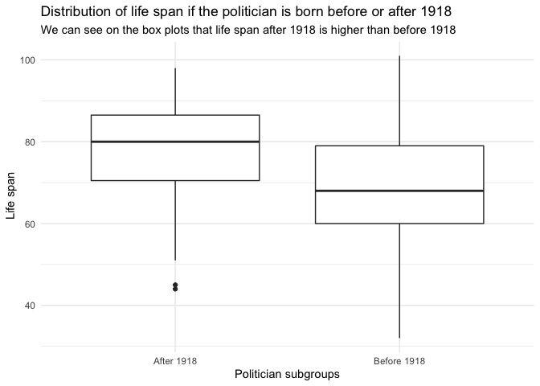

FDS Final Project: Report \#2
================

#### Libraries

``` r
library(DBI)
library(RSQLite)
library(tidyverse)
library(lubridate)
library(purrr)
library(janitor)
library(knitr)
library(kableExtra)
library(infer)
library(opencage)
library(magrittr)
library(leaflet)
```

#### Setting the main plot theme

``` r
theme_set(theme_minimal())
```

##### Connecting the database

``` r
politicians <- dbConnect(SQLite(),"zh_politicians.db")
```

##### Seeing the different tables

``` r
dbListTables(politicians)
```

    ## [1] "ADDRESSES"    "AFFILIATIONS" "MANDATES"     "PERSONS"

##### Assigning the tables to a variable

``` r
addresses_raw <- tbl(politicians,"ADDRESSES")
affiliations_raw <- tbl(politicians, "AFFILIATIONS")
mandates_raw <- tbl(politicians, "MANDATES")
persons_raw <- tbl(politicians, "PERSONS")
```

##### Cleaning tables

``` r
persons <- persons_raw %>% 
  mutate(YEAR_OF_DEATH = as.integer(YEAR_OF_DEATH),
         YEAR_OF_DEATH = na_if(YEAR_OF_DEATH,0)) %>%
  filter(!is.na(YEAR_OF_DEATH ), YEAR_OF_BIRTH!=0) %>% 
  rename(PERSON_ID = ID) %>% 
  collect()
```

``` r
affiliations <- affiliations_raw %>% 
  collect() %>% 
  filter(AFFILIATION_START_YEAR != 0,
         AFFILIATION_END_YEAR != 0,
         AFFILIATION_END_YEAR != 9999) 
```

``` r
mandates <- mandates_raw %>% 
  collect() %>% 
  filter(MANDATE_START_YEAR >1800) %>% 
  mutate(MANDATE_END_YEAR = if_else(MANDATE_END_YEAR==0, 2019L, MANDATE_END_YEAR)) %>% 
  rename(MANDATE_ID = ID)
```

``` r
addresses <- addresses_raw %>% 
  collect() %>% 
  filter(STREET != "",
         HOUSE_NUMBER != "",
         POSTAL_CODE != "") %>% 
  mutate(POSTAL_CODE = str_extract(POSTAL_CODE,"[0-9]+")) %>% 
  mutate(FULL_ADDRESS = str_c(STREET, HOUSE_NUMBER,POSTAL_CODE, CITY, sep = ", "))
```

## Part 1

##### Making a line plot showing how the number of people with an active mandate changed over the years.

``` r
num_mandates <- mandates%>% 
  left_join(persons, by = "PERSON_ID") %>% 
  mutate(MANDATE = map2(MANDATE_START_YEAR,MANDATE_END_YEAR-1,seq))%>% 
  select(ASSEMBLY,MANDATE,GENDER) %>% 
  unnest() %>% 
  arrange(MANDATE) %>% 
  group_by(ASSEMBLY) %>% 
  add_count(MANDATE)
```

``` r
num_mandates %>% 
  ggplot(aes(x=MANDATE,y=n))+
  geom_line(aes(color = ASSEMBLY))+
  labs(title = "Number of active mandates each year",
       subtitle = "The peaks are caused by election years when multiple mandates were active for the same seat",
       x = "years",
       y = "n")
```

<!-- -->

## Part 2

##### Showing facet charts of the previous plot

``` r
num_mandates %>% 
  filter(GENDER %in% c("m","w")) %>% 
  ggplot(aes(x=MANDATE,y=n, color = GENDER))+
  geom_line()+
  labs(title = "Number of active women and men's mandates each year per assembly",
       subtitle = "The peaks are caused by election years when multiple mandates were active for the same seat",
       x = "Years",
       y = "Number of politician")+
  facet_wrap("ASSEMBLY", scales = "free")
```

<!-- -->

## Part 3

##### Making a plot showing the proportion of elected politicians from each party in year 2000

``` r
pie_affiliations <- affiliations%>% 
  left_join(mandates, by = "MANDATE_ID") %>% 
  mutate(AFFILIATION = map2(AFFILIATION_START_YEAR,AFFILIATION_END_YEAR,seq)) %>% 
  select(PARTY,AFFILIATION,ASSEMBLY) %>% 
  unnest() %>% 
  filter(AFFILIATION==2000) %>% 
  count(PARTY,ASSEMBLY) %>% 
  group_by(ASSEMBLY) %>% 
  mutate(freq = n/sum(n)) %>% 
  ungroup() %>% 
  rename(NUMBER_OF_POLITICIANS = n,
         PROPORTION = freq) 
kable(pie_affiliations %>% 
        rename("NUMBER OF POLITICIANS" = NUMBER_OF_POLITICIANS)) %>% 
  add_header_above(c("Number and proportion of elected politicians from each party by assembly in 2000"=4)) %>% 
  kable_styling(bootstrap_options = c("striped", "hover", "condensed", "responsive"),
                full_width = F,
                fixed_thead = T)
```

<table class="table table-striped table-hover table-condensed table-responsive" style="width: auto !important; margin-left: auto; margin-right: auto;">

<thead>

<tr>

<th style="border-bottom:hidden; padding-bottom:0; padding-left:3px;padding-right:3px;text-align: center; position: sticky; top:0; background-color: #FFFFFF;" colspan="4">

<div style="border-bottom: 1px solid #ddd; padding-bottom: 5px; ">

Number and proportion of elected politicians from each party by assembly
in
2000

</div>

</th>

</tr>

<tr>

<th style="text-align:left;position: sticky; top:0; background-color: #FFFFFF;">

PARTY

</th>

<th style="text-align:left;position: sticky; top:0; background-color: #FFFFFF;">

ASSEMBLY

</th>

<th style="text-align:right;position: sticky; top:0; background-color: #FFFFFF;">

NUMBER OF
POLITICIANS

</th>

<th style="text-align:right;position: sticky; top:0; background-color: #FFFFFF;">

PROPORTION

</th>

</tr>

</thead>

<tbody>

<tr>

<td style="text-align:left;">

CVP

</td>

<td style="text-align:left;">

Cantonal Council

</td>

<td style="text-align:right;">

7

</td>

<td style="text-align:right;">

0.0769231

</td>

</tr>

<tr>

<td style="text-align:left;">

EVP

</td>

<td style="text-align:left;">

Cantonal Council

</td>

<td style="text-align:right;">

7

</td>

<td style="text-align:right;">

0.0769231

</td>

</tr>

<tr>

<td style="text-align:left;">

FDP

</td>

<td style="text-align:left;">

Cantonal Council

</td>

<td style="text-align:right;">

17

</td>

<td style="text-align:right;">

0.1868132

</td>

</tr>

<tr>

<td style="text-align:left;">

FDP

</td>

<td style="text-align:left;">

Executive Council

</td>

<td style="text-align:right;">

2

</td>

<td style="text-align:right;">

0.5000000

</td>

</tr>

<tr>

<td style="text-align:left;">

GP

</td>

<td style="text-align:left;">

Cantonal Council

</td>

<td style="text-align:right;">

3

</td>

<td style="text-align:right;">

0.0329670

</td>

</tr>

<tr>

<td style="text-align:left;">

LdU

</td>

<td style="text-align:left;">

Cantonal Council

</td>

<td style="text-align:right;">

2

</td>

<td style="text-align:right;">

0.0219780

</td>

</tr>

<tr>

<td style="text-align:left;">

parteilos

</td>

<td style="text-align:left;">

Cantonal Council

</td>

<td style="text-align:right;">

1

</td>

<td style="text-align:right;">

0.0109890

</td>

</tr>

<tr>

<td style="text-align:left;">

SD

</td>

<td style="text-align:left;">

Cantonal Council

</td>

<td style="text-align:right;">

1

</td>

<td style="text-align:right;">

0.0109890

</td>

</tr>

<tr>

<td style="text-align:left;">

SP

</td>

<td style="text-align:left;">

Cantonal Council

</td>

<td style="text-align:right;">

23

</td>

<td style="text-align:right;">

0.2527473

</td>

</tr>

<tr>

<td style="text-align:left;">

SP

</td>

<td style="text-align:left;">

Executive Council

</td>

<td style="text-align:right;">

1

</td>

<td style="text-align:right;">

0.2500000

</td>

</tr>

<tr>

<td style="text-align:left;">

SVP

</td>

<td style="text-align:left;">

Cantonal Council

</td>

<td style="text-align:right;">

30

</td>

<td style="text-align:right;">

0.3296703

</td>

</tr>

<tr>

<td style="text-align:left;">

SVP

</td>

<td style="text-align:left;">

Executive Council

</td>

<td style="text-align:right;">

1

</td>

<td style="text-align:right;">

0.2500000

</td>

</tr>

</tbody>

</table>

``` r
pie_affiliations %>% 
  mutate(PARTY = if_else(PROPORTION > 0.075,PARTY,"Others")) %>% 
  ggplot(aes(x="",y=PROPORTION,fill=PARTY))+
  geom_bar(stat = "identity", width = 1)+
  coord_polar("y",start = 0)+
  facet_wrap(vars(ASSEMBLY))+
  scale_y_continuous(labels = scales::percent)+
  labs(title = "Proportion of elected politicians from each party in 2000",
       subtitle = "By assembly",
       x = "",
       y = "Proportion of politicians in %")
```

<!-- -->

## Part 4

##### Making a line chart to show how it changed over the years.

``` r
line_affiliations <- affiliations %>% 
  left_join(mandates, by = "MANDATE_ID") %>% 
  mutate(AFFILIATION = map2(AFFILIATION_START_YEAR,AFFILIATION_END_YEAR-1,seq)) %>% 
  select(PARTY,AFFILIATION,ASSEMBLY) %>% 
  unnest() %>% 
  add_count(PARTY,AFFILIATION) %>% 
  group_by(ASSEMBLY,AFFILIATION) %>% 
  mutate(freq = n/sum(n)) %>% 
  ungroup() %>% 
  filter(AFFILIATION>2000)

line_affiliations %>%
  ggplot(aes(x = AFFILIATION, y = freq, color = PARTY))+
  geom_line()+
  facet_wrap(vars(ASSEMBLY),scales = "free")+
  labs(title = "Composition of assemblies.",
       subtitle = "Since 2000",
       x = "Affiliation years",
       y = "Proportion of politicians")+
  scale_y_continuous(labels = scales::percent)
```

<!-- -->

## Part 5

##### Looking for the average lifespan

``` r
mean_lifespan <- persons %>% 
  mutate(LIFESPAN = YEAR_OF_DEATH-YEAR_OF_BIRTH) %>% 
  filter(LIFESPAN>20&LIFESPAN<110) %>% 
  summarise(MEAN_LIFESPAN = mean(LIFESPAN))
```

The mean lifespan of politicians is 70.2 years

``` r
mean_lifespan_title<- persons%>% 
  mutate(LIFESPAN = YEAR_OF_DEATH-YEAR_OF_BIRTH) %>% 
  filter(LIFESPAN>20&LIFESPAN<110) %>% 
  filter(str_detect(TITLE,".+")) %>% 
  summarise(MEAN_LIFESPAN = mean(LIFESPAN))
```

The mean lifespan of politicians with title is 73.8

We see that the average lifespan changes if the politician has a title
or not.

``` r
title_persons <- persons%>% 
  mutate(TITLE = str_replace(TITLE, ".+", "title"),
         TITLE = str_replace(TITLE, "^", "no title"),
         TITLE = str_replace(TITLE,"no titletitle","title")) %>% 
  mutate(LIFESPAN = YEAR_OF_DEATH-YEAR_OF_BIRTH) %>% 
  filter(LIFESPAN>20&LIFESPAN<110)
title_persons %>% 
  ggplot(aes(TITLE,LIFESPAN))+
  geom_boxplot()+
  labs(title = "Distribution of life span by title or no title",
       subtitle = "Life span seems higher by politician with title",
       x = "Title",
       y = "Life span")
```

<!-- -->

##### Now doing a statistical est to assess if the average life span is different for politicians having a title compared to those without any title

``` r
title_test <- title_persons %>% 
  t_test(LIFESPAN~TITLE,
         order = c("title","no title")) %>% 
  mutate(p_value = scales::percent(p_value))
```

By this test we see that the difference is significant, the P-value : 0%
is below 5%. Also the intervals are away from 0. We can safely reject
the null hypothesis saying there is no difference in the average
lifespan if the politician has a title or
not.

## Part 6

##### Is there a difference between the subgroup before 1918 and those born on or after 1918?

``` r
subgroups_persons <- persons %>% 
  mutate(SUBGROUPS = if_else(YEAR_OF_BIRTH<1918,"Before 1918","After 1918")) %>% 
  mutate(LIFESPAN = YEAR_OF_DEATH-YEAR_OF_BIRTH) %>% 
  filter(LIFESPAN>20&LIFESPAN<110)
subgroups_persons %>% 
  ggplot(aes(SUBGROUPS,LIFESPAN))+
  geom_boxplot()+
  labs(title = "Distribution of life span if the politician is born before or after 1918",
       subtitle = "We can see on the box plots that life span after 1918 is higher than before 1918",
       x = "Politician subgroups",
       y = " Life span")
```

<!-- -->

``` r
subgroups <- title_persons %>% 
  mutate(SUBGROUPS = if_else(YEAR_OF_BIRTH<1918,"Before 1918","After 1918")) %>% 
  mutate(LIFESPAN = YEAR_OF_DEATH-YEAR_OF_BIRTH) %>% 
  filter(LIFESPAN>20&LIFESPAN<110)
```

``` r
before_1918 <- subgroups %>% 
  filter(SUBGROUPS == "Before 1918")
after_1918 <- subgroups %>% 
  filter(SUBGROUPS == "After 1918")
```

``` r
before_test <- before_1918 %>% 
  t_test(LIFESPAN~TITLE,
         order = c("title","no title")) %>% 
  mutate(p_value = scales::percent(p_value))

after_test <- after_1918 %>% 
  t_test(LIFESPAN~TITLE,
         order = c("title","no title")) %>% 
  mutate(p_value = scales::percent(p_value))
```

We can see here that the difference is statistically very significant
before 1918, the P-value : 0% is way below 5%, and the confidence
intervals are away from 0. However the P-value after 1918 :81% is way
above 5% and is absolutely not significant.

## Part 7

##### Which politicians have had the most mandates?

``` r
persons %>% 
  left_join(mandates, by = "PERSON_ID") %>% 
  mutate(FULLNAME = str_c(LASTNAME,FIRSTNAME, sep = " ")) %>% 
  mutate(MANDATES_NUM = MANDATE_END_YEAR - MANDATE_START_YEAR) %>% 
  select(FULLNAME,MANDATES_NUM) %>% 
  arrange(desc(MANDATES_NUM)) %>% 
  head(10) %>% 
  ggplot(aes(x = reorder(FULLNAME, MANDATES_NUM) ,y = MANDATES_NUM))+
  geom_bar(stat = "identity")+
  coord_flip()+
  labs(title = "Top 10 of politicians by number of mandates",
       subtitle = "Johann Stössel is the winner with 42 mandates !",
       x = "Name",
       y = "Number of mandates")
```

<!-- -->

## Part 8

##### Do some politicians have multiple mandates at the same time?

Yes there are 3 politicians. They are listed in the table below.

``` r
mult_mandates <- persons %>% 
  left_join(mandates, by = "PERSON_ID") %>% 
  mutate(FULLNAME = str_c(LASTNAME,FIRSTNAME, sep = " ")) %>% 
  select(FULLNAME,MANDATE_START_YEAR, MANDATE_END_YEAR) %>% 
  arrange(FULLNAME,MANDATE_START_YEAR,MANDATE_END_YEAR) %>% 
  group_by(FULLNAME) %>% 
  mutate(LAG = MANDATE_START_YEAR - lag(MANDATE_END_YEAR,n=1)) %>%
  filter(LAG<0) %>%
  distinct(FULLNAME) %>%
  rename(Politician = FULLNAME)
kable(mult_mandates) %>%
  kable_styling(bootstrap_options = c("striped", "hover", "condensed", "responsive"),
                full_width = F,
                fixed_thead = T,
                position = "left")
```

<table class="table table-striped table-hover table-condensed table-responsive" style="width: auto !important; ">

<thead>

<tr>

<th style="text-align:left;position: sticky; top:0; background-color: #FFFFFF;">

Politician

</th>

</tr>

</thead>

<tbody>

<tr>

<td style="text-align:left;">

Keller Albert

</td>

</tr>

<tr>

<td style="text-align:left;">

Kern Hans

</td>

</tr>

<tr>

<td style="text-align:left;">

Wettstein Ernst

</td>

</tr>

</tbody>

</table>

## Part 9

``` r
diff_party <- persons %>% 
  left_join(affiliations, by = "PERSON_ID") %>% 
  mutate(FULLNAME = str_c(LASTNAME,FIRSTNAME, sep = " ")) %>% 
  select(PERSON_ID,FULLNAME,PARTY) %>% 
  distinct(PERSON_ID,PARTY,FULLNAME) %>% 
  filter(duplicated(PERSON_ID)) %>%
  nrow()
```

Yes there are 136 politicians who have been affiliated to different
parties over the
years.

## Part 10

##### Plotting addresses on the map. I have to convert addresses to coordinates.

I used the API from : <https://opencagedata.com/demo> First I set my key
to a variable OPENCAGE\_KEY so I can access the API

``` r
Sys.setenv(OPENCAGE_KEY = "a0a23c106abf4f89937d118e3849ff24")
```

##### Getting the coordinates

``` r
coordinates <- addresses$FULL_ADDRESS %>% 
  sample(20) %>% 
  map(opencage_forward) %>% 
  map(pluck, "results") %>% 
  map(head, 1) %>% 
  map_dfr(extract,c("geometry.lat","geometry.lng")) %>% 
  as_tibble()
```

##### Plotting the coordinates on a map

``` r
coordinates %>% 
  leaflet() %>% 
  addTiles() %>% 
  addMarkers(lng=~geometry.lng,lat=~geometry.lat)
```

<!-- -->
