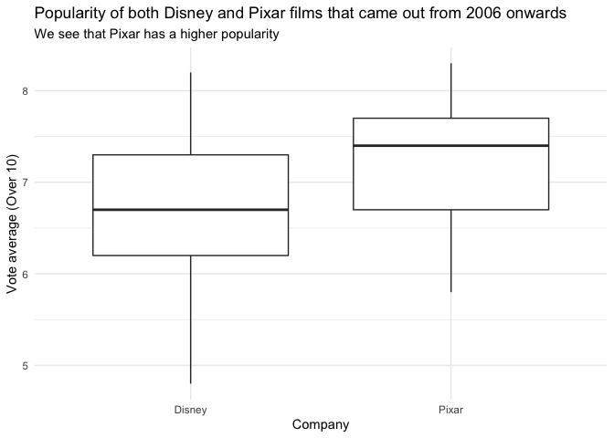

FDS Final Project: Report \#3
================

#### Libraries

``` r
library(tidyverse)
library(httr)
library(kableExtra)
library(magrittr)
library(jsonlite)
library(infer)
```

#### Setting the main plot theme

``` r
theme_set(theme_minimal())
```

## Part 1

##### What are the highest grossing dramas from 2010?

``` r
GET("https://api.themoviedb.org/3/discover/movie?api_key=2ca24be4c093bcfd24d334dba00bab8e&language=en-US&sort_by=vote_average.desc&include_adult=false&include_video=false&primary_release_year=2010&with_genres=18") %>% 
  content(as = "parsed") %>% 
  pluck("results") %>% 
  map_dfr(extract,c("title")) %>% 
  rename("Highest grossing dramas from 2010" = title) %>% 
  head(7) %>% 
  kable() %>% 
  kable_styling(bootstrap_options = c("striped", "hover", "condensed", "responsive"),
                full_width = F,
                fixed_thead = T)
```

<table class="table table-striped table-hover table-condensed table-responsive" style="width: auto !important; margin-left: auto; margin-right: auto;">

<thead>

<tr>

<th style="text-align:left;position: sticky; top:0; background-color: #FFFFFF;">

Highest grossing dramas from 2010

</th>

</tr>

</thead>

<tbody>

<tr>

<td style="text-align:left;">

18+ : True Love Never Dies

</td>

</tr>

<tr>

<td style="text-align:left;">

Fairview St.

</td>

</tr>

<tr>

<td style="text-align:left;">

In Too Deep

</td>

</tr>

<tr>

<td style="text-align:left;">

Jealous Jerzy

</td>

</tr>

<tr>

<td style="text-align:left;">

Janin

</td>

</tr>

<tr>

<td style="text-align:left;">

Ao sul de Setembro

</td>

</tr>

<tr>

<td style="text-align:left;">

The
Idiots

</td>

</tr>

</tbody>

</table>

##### Have Will Ferrell and Liam Neeson even been in a movie together?

``` r
num_movies_ferrell_neeson <- GET("https://api.themoviedb.org/3/discover/movie?api_key=2ca24be4c093bcfd24d334dba00bab8e&sort_by=popularity.desc&with_people=23659%2C3896") %>% 
  content() %>% 
  pluck("total_results")
```

Yes there has been 4 movies with them both
in.

##### Can you find kids movies with Tom Cruise in it?

``` r
kids_cruise <- GET("https://api.themoviedb.org/3/discover/movie?api_key=2ca24be4c093bcfd24d334dba00bab8e&sort_by=popularity.desc&certification.lte=G&with_cast=500") %>% 
  content() 
kids_cruise_results <- kids_cruise %>% 
  pluck("total_results")
```

Yes there are 69 kids movies with Tom Cruise in it.

``` r
kids_cruise %>% 
  pluck("results") %>% 
  map_dfr(extract,c("title")) %>% 
  rename("Some kids movies with Tom Cruise in it" = title) %>% 
  head(7) %>% 
  kable() %>% 
  kable_styling(bootstrap_options = c("striped", "hover", "condensed", "responsive"),
                full_width = F,
                fixed_thead = T)
```

<table class="table table-striped table-hover table-condensed table-responsive" style="width: auto !important; margin-left: auto; margin-right: auto;">

<thead>

<tr>

<th style="text-align:left;position: sticky; top:0; background-color: #FFFFFF;">

Some kids movies with Tom Cruise in it

</th>

</tr>

</thead>

<tbody>

<tr>

<td style="text-align:left;">

Mission: Impossible - Ghost Protocol

</td>

</tr>

<tr>

<td style="text-align:left;">

Mission: Impossible - Fallout

</td>

</tr>

<tr>

<td style="text-align:left;">

Mission: Impossible

</td>

</tr>

<tr>

<td style="text-align:left;">

Edge of Tomorrow

</td>

</tr>

<tr>

<td style="text-align:left;">

Mission: Impossible III

</td>

</tr>

<tr>

<td style="text-align:left;">

Mission: Impossible - Rogue Nation

</td>

</tr>

<tr>

<td style="text-align:left;">

Mission: Impossible
II

</td>

</tr>

</tbody>

</table>

## Part 2

##### Query for the movie company Pixar

``` r
pixar_id <- GET("https://api.themoviedb.org/3/search/company?api_key=2ca24be4c093bcfd24d334dba00bab8e&query=Pixar&page=1") %>% 
  content() %>% 
  pluck("results") %>% 
  map_dfr(extract,c("name","id")) %>% 
  filter(name == "Pixar") %>% 
  select(id)
```

The ID for Pixar company is :
3

## Part 3

##### Pixar movies by descending revenue

``` r
pixar_movies <- GET("https://api.themoviedb.org/3/discover/movie?api_key=2ca24be4c093bcfd24d334dba00bab8e&language=en-US&sort_by=popularity.desc&with_companies=3") %>% 
  content() %>% 
  pluck("results") %>% 
  map_dfr(extract,c("title", "popularity"))# I didn't see revenue in the JSON list so I put popularity
pixar_movies %>% 
  rename(Movie = title, Popularity = popularity) %>% 
  kable() %>% 
  add_header_above(c("Popularity of Pixar movies"=2)) %>% 
  kable_styling(bootstrap_options = c("striped", "hover", "condensed", "responsive"),
                full_width = F,
                fixed_thead = T)
```

<table class="table table-striped table-hover table-condensed table-responsive" style="width: auto !important; margin-left: auto; margin-right: auto;">

<thead>

<tr>

<th style="border-bottom:hidden; padding-bottom:0; padding-left:3px;padding-right:3px;text-align: center; position: sticky; top:0; background-color: #FFFFFF;" colspan="2">

<div style="border-bottom: 1px solid #ddd; padding-bottom: 5px; ">

Popularity of Pixar
movies

</div>

</th>

</tr>

<tr>

<th style="text-align:left;position: sticky; top:0; background-color: #FFFFFF;">

Movie

</th>

<th style="text-align:right;position: sticky; top:0; background-color: #FFFFFF;">

Popularity

</th>

</tr>

</thead>

<tbody>

<tr>

<td style="text-align:left;">

Cars

</td>

<td style="text-align:right;">

108.851

</td>

</tr>

<tr>

<td style="text-align:left;">

Onward

</td>

<td style="text-align:right;">

94.121

</td>

</tr>

<tr>

<td style="text-align:left;">

Toy Story 4

</td>

<td style="text-align:right;">

44.444

</td>

</tr>

<tr>

<td style="text-align:left;">

Finding Nemo

</td>

<td style="text-align:right;">

30.044

</td>

</tr>

<tr>

<td style="text-align:left;">

Toy Story

</td>

<td style="text-align:right;">

36.398

</td>

</tr>

<tr>

<td style="text-align:left;">

Inside Out

</td>

<td style="text-align:right;">

38.553

</td>

</tr>

<tr>

<td style="text-align:left;">

Coco

</td>

<td style="text-align:right;">

36.998

</td>

</tr>

<tr>

<td style="text-align:left;">

Brave

</td>

<td style="text-align:right;">

27.966

</td>

</tr>

<tr>

<td style="text-align:left;">

Monsters, Inc.

</td>

<td style="text-align:right;">

31.469

</td>

</tr>

<tr>

<td style="text-align:left;">

Incredibles 2

</td>

<td style="text-align:right;">

29.602

</td>

</tr>

<tr>

<td style="text-align:left;">

The Incredibles

</td>

<td style="text-align:right;">

26.403

</td>

</tr>

<tr>

<td style="text-align:left;">

Toy Story 3

</td>

<td style="text-align:right;">

26.438

</td>

</tr>

<tr>

<td style="text-align:left;">

Toy Story 2

</td>

<td style="text-align:right;">

26.166

</td>

</tr>

<tr>

<td style="text-align:left;">

A Bug’s Life

</td>

<td style="text-align:right;">

24.911

</td>

</tr>

<tr>

<td style="text-align:left;">

Ratatouille

</td>

<td style="text-align:right;">

26.475

</td>

</tr>

<tr>

<td style="text-align:left;">

Up

</td>

<td style="text-align:right;">

25.499

</td>

</tr>

<tr>

<td style="text-align:left;">

WALL·E

</td>

<td style="text-align:right;">

24.903

</td>

</tr>

<tr>

<td style="text-align:left;">

Cars 2

</td>

<td style="text-align:right;">

18.988

</td>

</tr>

<tr>

<td style="text-align:left;">

Monsters University

</td>

<td style="text-align:right;">

21.341

</td>

</tr>

<tr>

<td style="text-align:left;">

Finding
Dory

</td>

<td style="text-align:right;">

18.923

</td>

</tr>

</tbody>

</table>

## Part 4

##### Comparing the popularity of both Disney and Pixar films that came out from 2006.

First we need the
ID

``` r
disney_id <- GET("https://api.themoviedb.org/3/search/company?api_key=2ca24be4c093bcfd24d334dba00bab8e&query=Disney&page=1") %>% 
  content() %>% 
  pluck("results") %>% 
  map_dfr(extract, c("name","id")) %>% 
  filter(name == "Walt Disney Pictures") %>% 
  select(id)
```

Disney’s ID is
2

##### Now getting the vote counts and averages and making tibbles out of them

I had to bypass pagination, I found a way from jsonlite package and a
for
loop

``` r
disney_url <- "https://api.themoviedb.org/3/discover/movie?api_key=2ca24be4c093bcfd24d334dba00bab8e&language=en-US&sort_by=vote_average.desc&with_companies=2&primary_release_date.gte=2006-01-01"
pages_disney <- list()
for(i in 1:9){
  mydata <- fromJSON(paste0(disney_url,"&page=",i))
  pages_disney[[i+1]] <- mydata$results
}
disney_tib <- rbind_pages(pages_disney) %>% 
  select(original_title,vote_average,vote_count) %>% 
  mutate(company = "Disney")

pixar_url <- "https://api.themoviedb.org/3/discover/movie?api_key=2ca24be4c093bcfd24d334dba00bab8e&language=en-US&sort_by=vote_average.desc&with_companies=3&primary_release_date.gte=2006-01-01"
pages_pixar <- list()
for(i in 1:4){
  mydata <- fromJSON(paste0(pixar_url,"&page=",i))
  pages_pixar[[i+1]] <- mydata$results
}
pixar_tib <- rbind_pages(pages_pixar) %>% 
  select(original_title,vote_average,vote_count) %>% 
  mutate(company = "Pixar")
```

##### Now binding the 2 tables and I took out counts that are under 50 so the data is representative.

``` r
movies <- bind_rows(pixar_tib,disney_tib) %>% 
  filter(vote_count > 50) %>% 
  arrange(desc(vote_average)) 
```

##### Plotting the data in boxplots :

``` r
movies %>% 
  ggplot(aes(x = company, y = vote_average))+
  geom_boxplot()+
  labs(title = "Popularity of both Disney and Pixar films that came out from 2006 onwards",
       subtitle = "We see that Pixar has a higher popularity",
       x = "Company",
       y = "Vote average (Over 10)")+
  theme_minimal()
```

<!-- -->

##### Now doing a t-test to evaluate the significance of our results

``` r
movie_ttest <- movies %>% 
  t_test(vote_average~company,
         order = c("Disney","Pixar")) %>% 
  mutate(p_value = scales::percent(p_value))
```

We see that the P-value : 0% is below 5% and the confidence interval
doesn’t contain 0.  
We can then safely reject the null hypothesis saying there is no
difference of average vote average between the 2 company’s movies.  
So the films from Pixar are indeed more popular than Disney’s from 2006.
